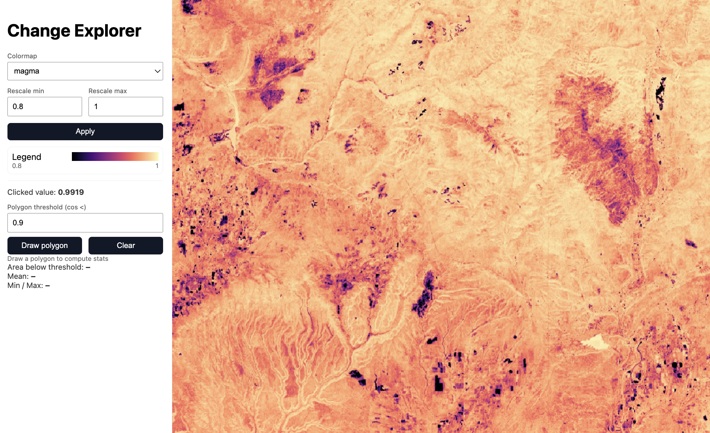

# Change Explorer



A web-based interface for exploring satellite imagery changes using cosine similarity data derived from Google Earth Engine embeddings. This project demonstrates the value of extracting and analyzing satellite data by providing an interactive visualization tool.

## Overview

The Change Explorer allows users to:
- **Visualize COG Data**: Display Cloud Optimized GeoTIFF files with customizable colormaps and rescale ranges
- **Interactive Analysis**: Click on the map to probe pixel values in real-time
- **Spatial Statistics**: Draw polygons to compute area statistics and identify regions below thresholds
- **Dynamic Visualization**: Adjust colormaps and data ranges on-the-fly

## Features

- **Real-time Tile Serving**: Uses TiTiler to serve COG files as dynamic map tiles
- **Interactive Map**: Built with MapLibre GL JS for smooth pan/zoom and interaction
- **Flexible Colormaps**: Choose from multiple colormap options (viridis, magma, etc.)
- **Data Rescaling**: Adjust the visual range to highlight specific value ranges
- **Point Queries**: Click anywhere to see exact pixel values
- **Polygon Analysis**: Draw areas to compute statistics and identify change regions

## Architecture

### Backend (TiTiler)
- **Purpose**: Serves Cloud Optimized GeoTIFF files as map tiles
- **Features**: Dynamic tile generation, colormap application, point queries, polygon statistics
- **Technology**: FastAPI + Rasterio/GDAL, containerized with Docker

### Frontend (MapLibre GL JS)
- **Purpose**: Interactive web interface for data exploration
- **Features**: Map visualization, controls, statistics display
- **Technology**: Vanilla JavaScript, MapLibre GL JS, Mapbox Draw for polygon tools

## Quick Start

### Prerequisites
- Docker Desktop
- Python 3.x
- A COG file in the `data/` directory

### 1. Start TiTiler Backend
```bash
docker run -d --rm --name titiler \
  --platform linux/amd64 \
  -p 8001:80 \
  -v "$(pwd)/data":/data \
  ghcr.io/developmentseed/titiler:latest
```

### 2. Serve Frontend
```bash
python3 -m http.server 5500 -d frontend --bind 127.0.0.1
```

### 3. Open Application
Navigate to `http://127.0.0.1:5500/` in your browser

### Data Preparation (Optional)
If you want to generate your own cosine similarity data:

1. **Copy the GEE Script**: Use the script from `scripts/gee_cosine_similarity.js`
2. **Open Earth Engine**: Go to [Google Earth Engine Code Editor](https://code.earthengine.google.com/)
3. **Paste and Run**: Copy the script, define your Area of Interest (AOI), and run
4. **Export Data**: Export as GeoTIFF to Google Drive, then download
5. **Place in Data Folder**: Put the `.tif` file in the `data/` directory

**Note**: The script computes cosine similarity between satellite embeddings from different years to detect land cover changes.

#### Detailed GEE Workflow

**Step 1: Set up your Area of Interest (AOI)**
- In the GEE Code Editor, use the drawing tools to create a geometry
- Or import a shapefile/KML file using the "Assets" tab
- The script will automatically use this as your `geometry` variable

**Step 2: Run the script**
- Click the "Run" button in the Code Editor
- The script will process and display layers on the map
- You should see:
  - Embeddings for 2020 (pseudoRGB)
  - Embeddings for 2024 (pseudoRGB) 
  - Cosine similarity layer (main output)

**Step 3: Export the data**
- After running, go to the "Tasks" tab in the Code Editor
- You'll see a task named "sanjuans_cosine_2020_2024"
- Click "Run" on this task to start the export
- Choose your Google Drive folder destination
- The export will process in the background (may take 10-30 minutes)

**Step 4: Download and convert**
- Once the task completes, download the GeoTIFF from Google Drive
- Convert to COG format using GDAL:
  ```bash
  # Install GDAL if you haven't already
  # macOS: brew install gdal
  # Ubuntu: sudo apt-get install gdal-bin
  
  # Convert to COG
  gdal_translate input.tif output_cog.tif -of COG -co COMPRESS=LZW
  ```
- Place the COG file in your `data/` folder
- Update the filename in `frontend/app.js` if needed

## Usage Guide

### Basic Visualization
1. **Load Data**: The map automatically loads your COG file
2. **Adjust Colormap**: Use the dropdown to select different color schemes
3. **Set Rescale Range**: Input min/max values and click "Apply"
4. **Explore**: Pan and zoom around the map

### Interactive Analysis
1. **Probe Values**: Click on the colored areas to see pixel values
2. **Draw Polygons**: Click "Draw polygon" then click on the map to create shapes
3. **View Statistics**: See area, mean, and min/max values for drawn regions
4. **Set Thresholds**: Use the threshold input to identify areas below specific values

### Advanced Features
- **Legend**: The color bar shows the current colormap and scale
- **Bounds**: The map automatically constrains to your data's geographic extent
- **Error Handling**: Graceful handling of clicks outside data bounds

## Project Structure

```
satellite-embeddings-frontend/
├── backend/           # TiTiler Docker configuration
├── data/             # COG files (e.g., sanjuans_cosine_2020_2024_cog.tif)
├── frontend/         # Web application
│   ├── index.html    # Main HTML structure
│   ├── app.js        # MapLibre integration and logic
│   ├── styles.css    # Styling and layout
│   └── images/       # Application screenshots
├── scripts/          # Data generation scripts
│   └── gee_cosine_similarity.js  # Google Earth Engine script
├── PRD.md           # Project requirements document
└── README.md        # This file
```

## Technical Details

### COG Requirements
- **Format**: Cloud Optimized GeoTIFF
- **Projection**: Web Mercator (EPSG:3857) or compatible
- **Data Type**: Single-band float data (e.g., cosine similarity values)

### API Endpoints
- **Tiles**: `GET /cog/tiles/{z}/{x}/{y}.png`
- **Point Queries**: `GET /cog/point/{lon},{lat}`
- **Polygon Stats**: `POST /cog/feature`
- **TileJSON**: `GET /cog/WebMercatorQuad/tilejson.json`

### Browser Compatibility
- Modern browsers with WebGL support
- Chrome, Firefox, Safari, Edge (latest versions)

## Troubleshooting

### Common Issues
1. **"Port already allocated"**: Stop existing containers with `docker stop titiler`
2. **"Black blobs" on map**: These are hidden draw controls; use sidebar buttons instead
3. **No tiles loading**: Check TiTiler is running and COG file path is correct
4. **500 errors on clicks**: Ensure clicks are within the data bounds

### Debug Commands
```bash
# Check TiTiler status
docker ps | grep titiler

# Test tile endpoint
curl "http://localhost:8001/cog/tiles/9/102/196.png?url=/data/your_file.tif"

# View TiTiler logs
docker logs titiler
```

### GEE Script Troubleshooting

**Common Issues:**
1. **"geometry is not defined"**: Make sure you've drawn a polygon or imported geometry in the Code Editor
2. **"No valid pixels"**: Your AOI might be outside the data coverage area
3. **Export fails**: Check that you have sufficient quota and storage space
4. **Script runs but no layers appear**: Check the Console tab for error messages

**Performance Tips:**
- Start with smaller AOIs for testing
- Use the "Inspector" tab to check pixel values
- Monitor the "Tasks" tab for export progress
- Large exports (>1GB) may take several hours

## Development

### Adding New Features
- **New Colormaps**: Add to the dropdown in `index.html`
- **Additional Statistics**: Extend the polygon analysis in `app.js`
- **Custom Controls**: Add new UI elements to the sidebar

### Code Style
- Vanilla JavaScript (no frameworks)
- CSS Grid for layout
- Responsive design principles
- Error handling for all API calls

### Customizing the GEE Script

**Change Years**: Modify the `y1` and `y2` variables to compare different time periods
```javascript
var y1 = 2018, y2 = 2023;  // Compare 2018 vs 2023
```

**Change Region**: Import different geometries or draw new AOIs in the Code Editor

**Modify Bands**: Adjust the `rgbBands` array for different visualization
```javascript
var rgbBands = ['A02','A15','A08'];  // Different embedding bands
```

**Export Options**: Modify the export parameters for different scales or formats
```javascript
Export.image.toDrive({
  image: out,
  description: 'my_custom_analysis',
  region: aoi,
  scale: 30,              // 30m resolution (faster, smaller)
  fileFormat: 'GeoTIFF',
  maxPixels: 1e12         // Smaller export limit
});
```

## Contributing

1. Fork the repository
2. Create a feature branch
3. Make your changes
4. Test thoroughly
5. Submit a pull request

## License

This project is open source. Please check individual component licenses for TiTiler and MapLibre GL JS.

## Acknowledgments

- **TiTiler**: Dynamic tile server for COG files
- **MapLibre GL JS**: Open-source mapping library
- **Google Earth Engine**: Data source and processing platform
- **Mapbox Draw**: Polygon drawing tools

---

*Built for exploring satellite imagery changes and demonstrating the value of geospatial data extraction.*
